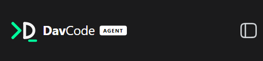
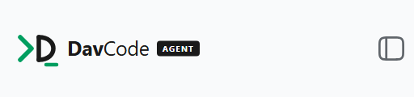

# dsh-brand-davcode

Gives this installation its own identity: **DavCode AGENT**.

It replaces the shipped brand in every seat the UI exposes, and nothing else. No
shipped file is modified, and removing the row restores the original marks.

## What it takes over

| Seat | Declared by | What it replaces |
|---|---|---|
| `sidebar.brand.mark` | `dsh-client-ui-sidebar` | the fish mark in the brand row and the collapsed rail |
| `sidebar.brand.name` | `dsh-client-ui-sidebar` | the "DeepSeek Harness" wordmark |
| `conversation.hero.brand.mark` | `dsh-client-ui-conversation` | the animated fish on the blank-session screen, and the greeting and preview badge beside it |
| the window title | `dsh-client-ui-layout` | the product half of `«session title» — DeepSeek Harness` |
| the tab icon | the served page | the shipped favicon |

The hero seat is the interesting one: it is declared `single` with **no occupant** and
a `replaceRisk` of `none`, which is what the shipped brand bundle means when it says the
official build "registers nothing there" and leaves the animated fish as a fallback. It
is a seat built to be filled.

## The blank-session screen shows the brand alone

The host draws its own greeting and preview badge in the same row as the artwork
("Into the Unknown", "Verso l'ignoto", "探索未至之境" …). The brand is meant to stand there by
itself, and it does so in **every language**, because nothing is translated, emptied or
keyed on a locale: the reconciler finds the box that holds this pack's artwork, keeps it,
and takes the *sibling* out of the layout (`display: none`, restored on unload). It is
derived from the DOM around the artwork — not from a class name, not from a string — so a
renamed module class or a reworded greeting changes nothing here. `tools/brand/test-brand.mjs`
drives the same three strings through it and asserts the copy stays out of the layout,
and `tools/brand/inspect-brand.cjs` reports the live `display` of that box in the running UI.

## The artwork

| dark | light |
|---|---|
|  |  |

Both captures are the sidebar row in the running UI, taken with `tools/brand/inspect-brand.cjs`.

The lockup and the mark are the author's own SVGs, **transcribed**. Every number in
`lib/client.js` is one of theirs — the 495×120 lockup canvas, the 120×120 mark canvas with
its `translate(-21, -5)` group shift, the name at (150, 78) in 50px with `Dav` at 700 and
`Code` at 400, the `106×38` badge at `translate(372, 41)` with its 20px label at (53, 19),
and the four strokes of the icon. Nothing is averaged, re-derived or re-centred, and the
badge label is centred by `text-anchor="middle"` and `dominant-baseline="central"` exactly
as drawn — never by arithmetic over its width, which is what put it off-centre once.

Two things are structural rather than literal, and neither moves a coordinate:

- **Both palettes ship.** The drawing was supplied twice — once for the dark ground
  (`#00FF9D` accent, `#F5F5F5` ink, `#FFFFFF` name, white badge with black `AGENT`) and once
  for the light one (`#009E60`, `#1A1A1A`, dark badge with white `AGENT`). Each colour is
  stored as that pair and resolved from the active colour scheme, so the brand follows the
  theme instead of the ground it was exported for. The tab icon is the one exception: a
  browser tab has no theme to inherit, so it keeps the dark pair on a `#141414` ground.
- **The row is a scale, not a crop.** The row's brand box declares `height: 24px` and clips at
  it, which is what made the wordmark read too small: the shipped row actually has 60px with
  8px of padding, so the artwork may be **44** tall. The pack opens that box (it is found
  structurally — the outermost ancestor of the artwork still inside the row — and every
  clipping ancestor up to it is set to `overflow: visible`; the row's own padding box is then
  what bounds the drawing) and sizes the canvas to the room the row has, so a dragged-narrow
  sidebar scales it down instead of pushing it over the panel toggle, and never below 24.
  Both axes move together: the aspect is the drawing's. Measured in the running UI at a 280px
  sidebar: **181.5 × 44**, the whole canvas in the clear, with the name rendering at 18.3px
  (the shipped row's own name size is 18px); at 164px of room the fit gives 164 × 39.75.

`Mark` is the mark alone (the rail and the toggle button, 24×24 as the seat asks), `Lockup`
is the whole artwork at whatever edge it is given, and both scale uniformly by that one
factor. The row passes what `fitRow` measures (30 on the first paint, up to 44); the
blank-session screen passes **56**, which this pack sets as its own floor — the host's edge of
34 is the width it reserves for the fish mark, not a size for this artwork, and with the
greeting gone the brand is the whole of that screen's head (231 × 56, the name at 23.3px). A
host that asks for more than the floor still gets it.

## How the scheme is followed

The layout presenter writes `document.documentElement.style.colorScheme` from the composed
theme's own `colorScheme` on every `theme/change` ("never the id — `system` is a
preference"), so that attribute *is* the theme service's answer, readable without depending
on that service being mounted. The pack watches it (with `prefers-color-scheme` as the
fallback before the first answer) into one store, so a switch repaints the row, the rail and
the hero together.

## Two mechanisms, and why

**The seats are taken with priority `-1`.** They are `single`, and the shipped fish holds
them at priority 0; the registry states its own rule — "already has a registration at
priority 0 … register at a different priority to shadow it (lowest renders)" — so going
below the occupant takes the seat. A higher number loses, and no number at all throws.

**The title is rewritten, not set once.** The layout owns `document.title`: it writes
`«session title» — «product»` when a session is selected and the bare product name
otherwise, on every change. So this pack watches the `<title>` element and replaces the
product half wherever it appears, including the session-title case. A one-shot write would
be lost on the next session switch.

## The safety net

The row's artwork already contains the icon, and the separate mark seat exists for the
collapsed rail. A reconciler hides that seat **only while this pack's own artwork is laid
out in the row** — measured, not assumed, so either way the app hides the name (unmounted
or styled) leaves the rail with its icon, and a refused registration can never leave the
brand row empty.

## What it deliberately does not do

- **It does not touch host-side copy**: the CLI banner, package descriptions, the data
  directory. Those are upstream's own strings and out of a client pack's reach.
- **It does not use the official marks.** DeepSeek's published brand guidelines ask that a
  renamed project not reuse the "DeepSeek Harness" trademark or the official brand
  material, and that it may describe itself as "built on DSH" in prose instead. Replacing
  the fish in both seats is what that requires, not a nicety.
- **It does not draw anything of its own.** If the artwork needs to change, it changes in
  the drawing and is transcribed again — `tools/brand/test-brand.mjs` asserts every
  coordinate, weight, anchor and colour of both palettes, so an edit that "improves" a
  position fails the suite instead of shipping.

## Verifying it

```sh
node tools/brand/test-brand.mjs                       # the four SVGs, both palettes, the seats, the effects
node tools/brand/inspect-brand.cjs <url> both         # row, rail and hero in the running UI, both schemes
node tools/brand/shoot-rail.cjs <url> dark            # the collapsed sidebar whole
node tools/brand/shoot-hero.cjs <url> light           # the blank-session screen whole
```

`inspect-brand.cjs` prints the geometry that decides the fit — the lockup box, the brand
box, and the band of the drawn canvas the box actually shows — so a change in the shipped
CSS that would clip the art is visible as a number, not as a surprise.

## Turning it off

Remove the `brand-davcode` row from the profile patch, or the `dsh-brand-davcode` bundle
from `dsh.profile.bundles`, and restart: the seats return to the shipped fish, and the
next title write is the original one.
